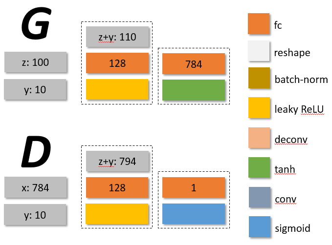
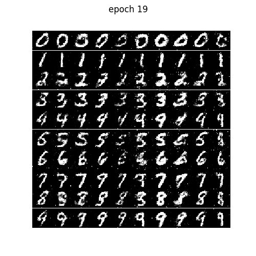
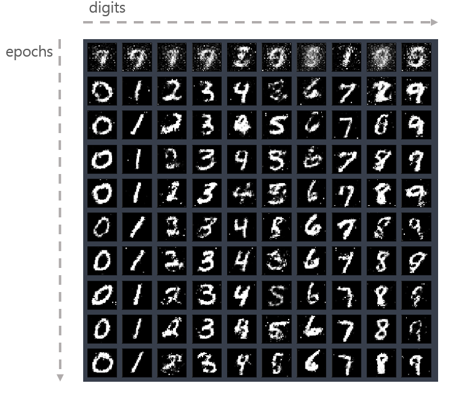
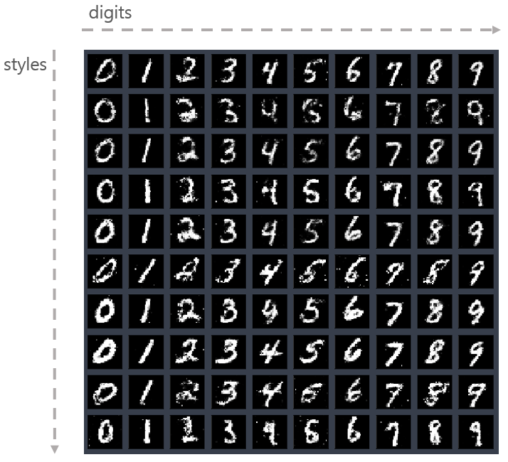

# Conditional GAN on MNIST - tensorflow

## Reference
http://wiseodd.github.io/techblog/2016/12/24/conditional-gan-tensorflow/

## Network at a glance

| **Generator**, **Discriminator** |
| --- |
|  |

### Training Losses

| tensorflow |
| --- |
|  |

### Generated samples via epochs

| epochs | tensorflow |
| --- | --- |
| 0 |  |
| 9 |  |
| 19 |  |
| 29 |  |
|  |  |

### Generated results by epochs - fixed classes
| tensorflow |
| --- |
|  |

### Generated results by epochs - fixed classes & fixed z
| tensorflow |
| --- |
|  |
