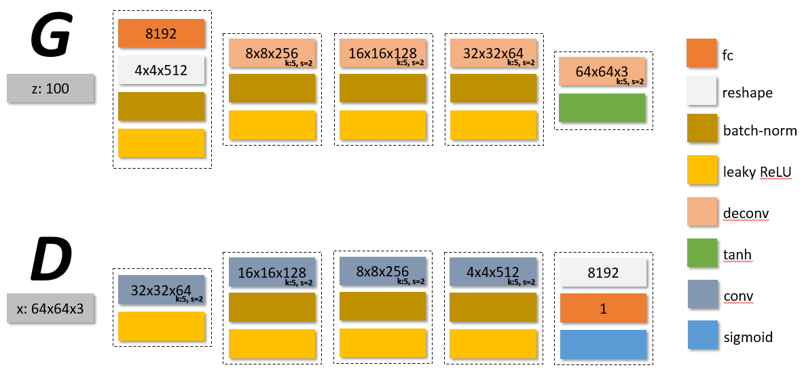
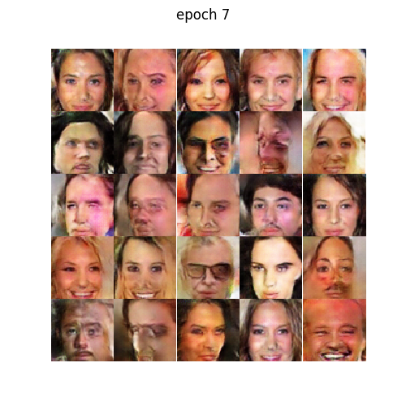
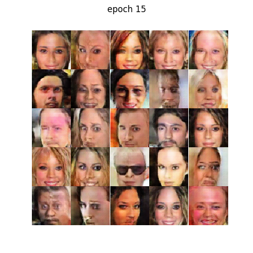

# DCGAN on celebA dataset - tensorflow & pytorch

## Network at a glance

| **Generator**, **Discriminator** |
| --- |
|  |

### Training Losses

| tensorflow | pytorch |
| --- | --- |
|  |  |

### Generated samples via epochs

| epochs | tensorflow | pytorch |
| --- | --- | --- |
| 0 |  |  |
| 7 |  |  |
| 15 |  |  |
| 19 |  |  |
|  |  |  |