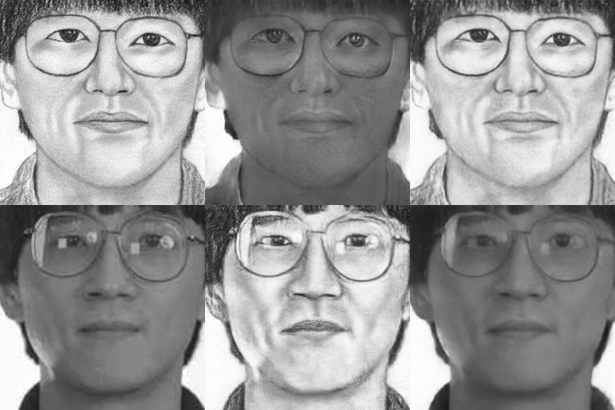
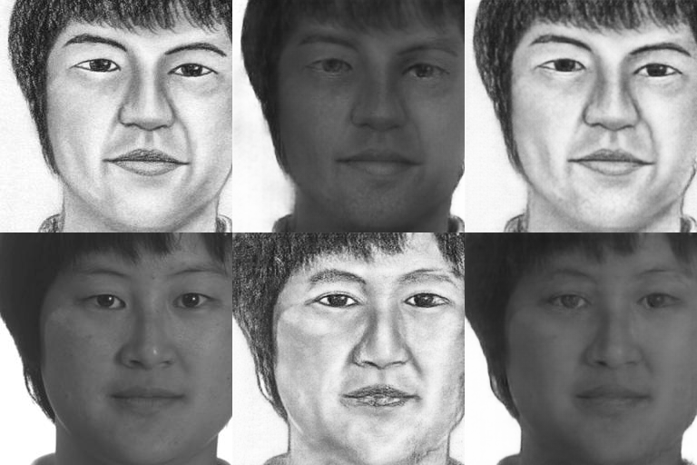

# Implementation of DualGAN in tensorflow

## Reference

* https://arxiv.org/abs/1704.02510
* hhttps://github.com/duxingren14/DualGAN

## Current Results

| sketch-photo dataset |
| :---: |
| Input Real sketch -> Generated photo -> Generated sketch |
| Input Real photo -> Generated sketch -> Generated photo |
|  |
|  |
|  |

