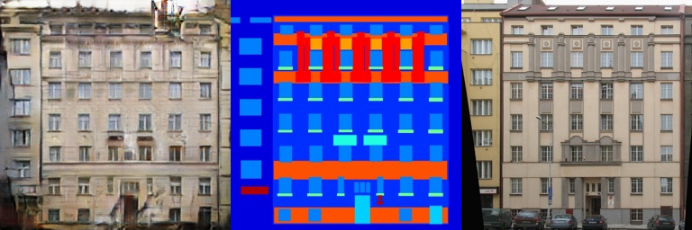
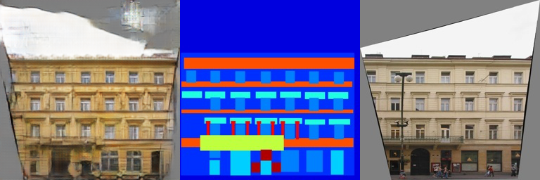

# Implementation of pix2pix in tensorflow

## Reference

* https://arxiv.org/pdf/1611.07004v1.pdf
* https://affinelayer.com/pix2pix/
* https://github.com/affinelayer/pix2pix-tensorflow

## Current Results

* facades
  * epochs: 200
  * batch size: 1
  * learning rate: 0.0002
  * training time: 2h 32m (GTX 1080 Ti - Ubuntu)
  * image manipulation
    * random flip
    * resize jitter + random crop

| Generator output - Generator input - Ground truth |
| --- | 
| |
| |
| |
| |
| |
| |
 

