# GANs
* Generative Adversarial Networks
  * GAN
  * CGAN
  * WGAN
  * WGAN-GP
  * DRAGAN

## MNIST Results
| Type | Epochs 1 | Epochs 15 | Epochs 30 |
| ---- | -------- | --------- | --------- |
| GAN | 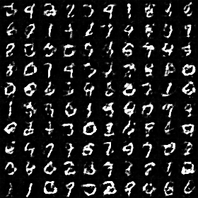 | 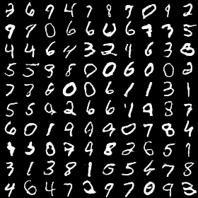 | 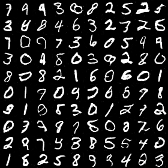 |
| CGAN | 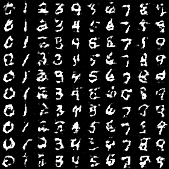 | 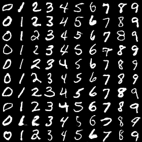 | 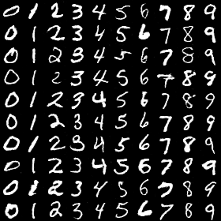 |
| WGAN | 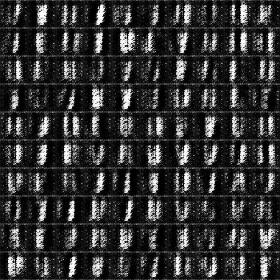 | 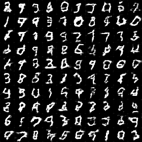 | 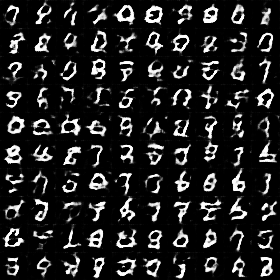 |
| WGAN-GP |  | 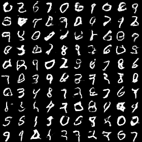 |  |
| DRAGAN | 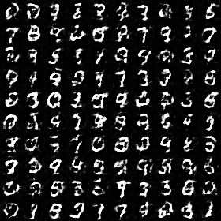 | 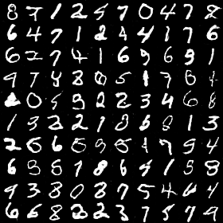 | 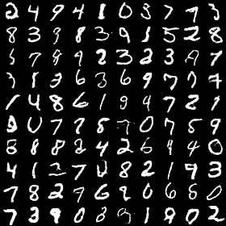 |
  


## Prerequisites

* Conda environment in Windows 10 & Ubuntu 14.04 **(Currently pytorch is only tested on Ubuntu)**
* Key components
  * python = 3.5
  * tensorflow >= 1.2.1
  * pytorch = 0.1.12

```shell
# Windows
conda create -n tf-pytorch python=3.5
activate tf-pytorch
pip install --ignore-installed --upgrade https://storage.googleapis.com/tensorflow/windows/gpu/tensorflow_gpu-1.2.1-cp35-cp35m-win_amd64.whl
conda install -c peterjc123 pytorch
```

```shell
# Ubuntu
conda create -n tf-pytorch python=3.5
source activate tf-pytorch
pip install --ignore-installed --upgrade https://storage.googleapis.com/tensorflow/windows/gpu/tensorflow_gpu-1.2.1-cp35-cp35m-win_amd64.whl
conda install pytorch torchvision cuda80 -c soumith
```

## Downloading data-sets

* MNIST & fashion-MNIST
  * fashion-MNIST: https://github.com/zalandoresearch/fashion-mnist
```python
# tensorflow
from tensorflow.examples.tutorials.mnist import input_data
mnist = input_data.read_data_sets('data_set/MNIST_data', one_hot=True)

# pytorch
import torch.utils.data
import torchvision

# data_loader normalize [0, 1] ==> [-1, 1]
transform = torchvision.transforms.Compose(
    [torchvision.transforms.ToTensor(),
     torchvision.transforms.Normalize(mean=(0.5, 0.5, 0.5), std=(0.5, 0.5, 0.5)) ])
train_loader = torch.utils.data.DataLoader(
    torchvision.datasets.MNIST('data_set/MNIST_data', train=True, download=True, transform=transform),
    batch_size=128, shuffle=True)
```

* CelebA
  * https://drive.google.com/drive/folders/0B7EVK8r0v71pWEZsZE9oNnFzTm8
* Pix2Pix
  * refer to: https://github.com/affinelayer/pix2pix-tensorflow
* DualGAN
  * refer to: https://github.com/duxingren14/DualGAN
 
## Acknowledgments

* 
