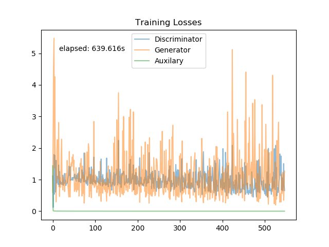

# GAN
* Generative Adversarial Networks
  * GAN
  * CGAN
  * WGAN
  * WGAN-GP

## Results - MNIST
| Type | Generation | Loss |
| ---- | --------- | ---- |
| GAN |  |  |
| WGAN |  |  |
| WGAN-GP |  |  |
| CGAN |  |  |
| ACGAN |  |  |

## Results - fashion-MNIST
| Type | Generation | Loss |
| ---- | --------- | ---- |
| GAN |  |  |
| WGAN |  |  |
| WGAN-GP |  |  |
| CGAN |  |  |
| ACGAN |  |  |

## Prerequisites
* Ubuntu 16.04
* tensorflow-gpu==1.13.1
* tensorflow-datasets==1.0.1

## Data sets
* MNIST & fashion-MNIST: `dataset_loader.py`

## Reference
* Based on: https://github.com/hwalsuklee/tensorflow-generative-model-collections
