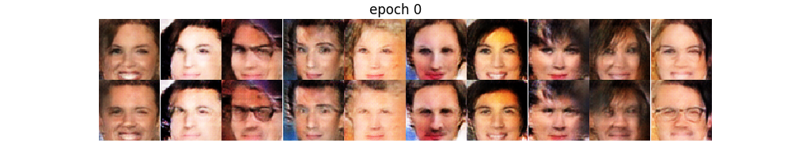
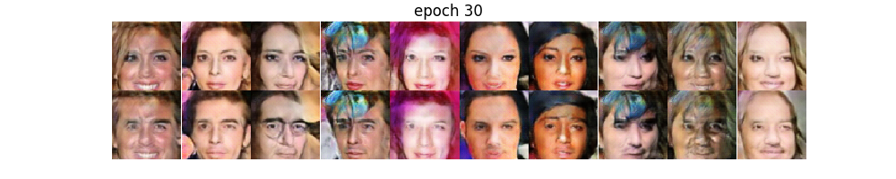
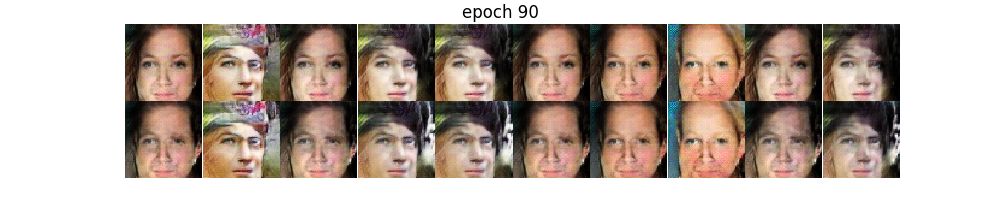
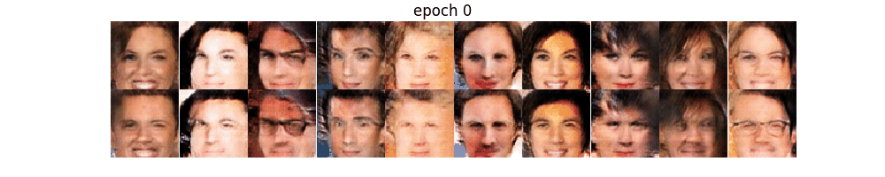

# Conditional DCGAN on celebA - tensorflow

## Network at a glance

| **Generator**, **Discriminator** |
| --- |
|  |

### Training Losses

| tensorflow |
| --- |
|  |

### Generated samples via epochs

* first row: female
* second row: male

| epochs | tensorflow |
| --- | --- |
| 0 |  |
| 30 |  |
| 60 |  |
| 90 |  |
|  |  |
