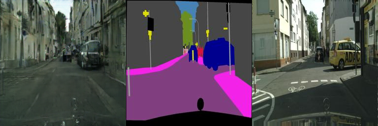
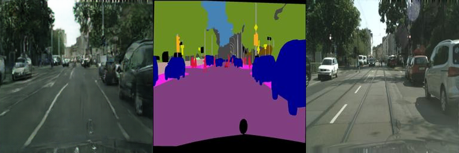
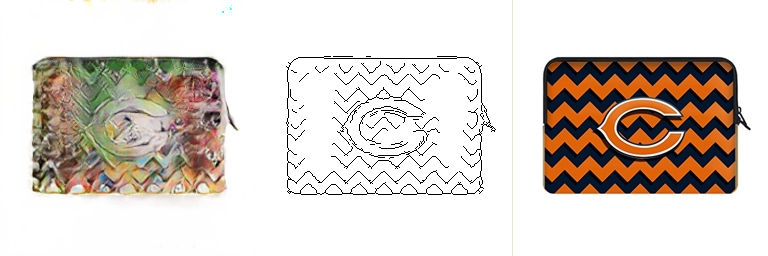
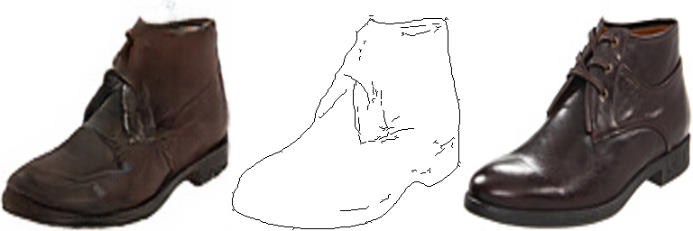
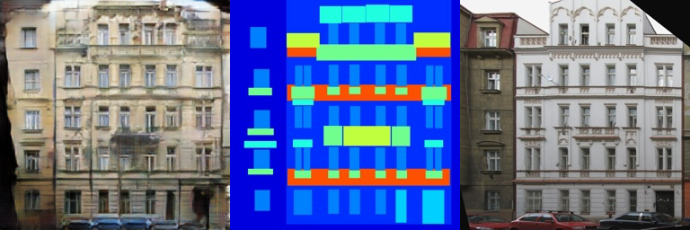
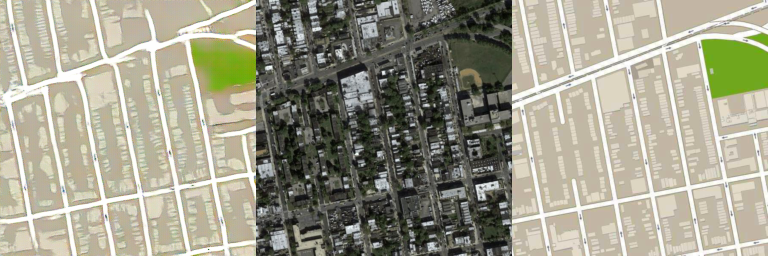
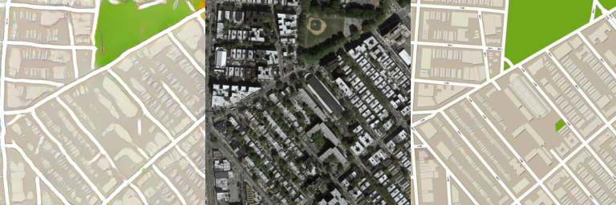

# Implementation of pix2pix in tensorflow

## Reference

* https://arxiv.org/pdf/1611.07004v1.pdf
* https://affinelayer.com/pix2pix/
* https://github.com/affinelayer/pix2pix-tensorflow

## Current Results

* cityscapes

| Generator output - Generator input - Ground truth |
| --- | 
| |
| |
| |
| |

* edges2handbags

| Generator output - Generator input - Ground truth |
| --- | 
| |
| |
| |
| |

* edges2shoes

| Generator output - Generator input - Ground truth |
| --- | 
| |
| |
| |
| |

* facades

| Generator output - Generator input - Ground truth |
| --- | 
| |
| |
| |
| |

* maps

| Generator output - Generator input - Ground truth |
| --- | 
| |
| |
| |
| |
 

